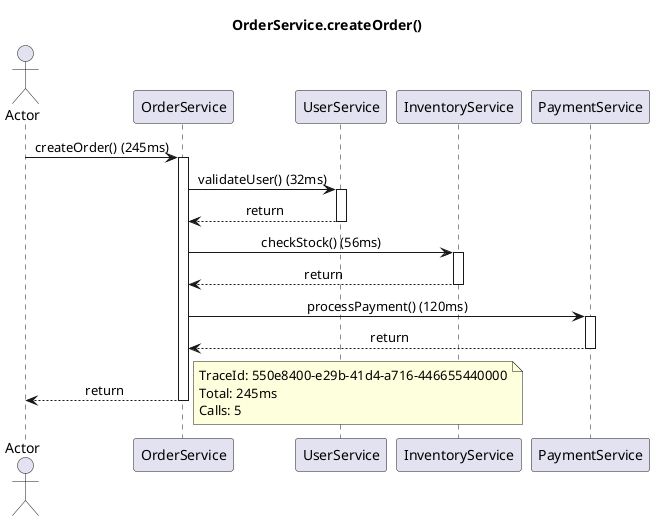

# Java 方法调用追踪 Agent

纯 Java 实现的方法调用追踪工具，**完全无侵入**，自动生成 PlantUML 时序图和相关源码归档。

## 特性

- ✅ **纯 Java 实现** - 不依赖 Spring 等框架
- ✅ **完全无侵入** - 无需修改业务代码，通过 Java Agent 实现
- ✅ **自动源码归档** - 收集调用链涉及的所有 Java 源文件
- ✅ **PlantUML 时序图** - 生成标准 PlantUML 格式时序图
- ✅ **包级过滤** - 只追踪指定的业务代码包
- ✅ **性能友好** - 低开销，支持调用深度限制

## 快速开始

### 1. 编译 Agent

```bash
cd java-method-tracer
mvn clean package
```

生成的 `target/method-tracer-agent-1.0.0.jar` 就是 Agent 包。

### 2. 运行带追踪的程序

```bash
# 编译示例程序
cd example
mvn clean package

# 运行并附加 Agent
java -javaagent:../target/method-tracer-agent-1.0.0.jar=outputDir=./trace-output;includePackages=com.example \
     -jar target/tracer-example-1.0.0.jar
```

### 3. 查看输出

运行后会在 `trace-output/` 目录下生成：

```
trace-output/
└── {traceId}/
    ├── sequence.puml      # PlantUML 时序图
    ├── calls.json         # 原始调用数据（JSON）
    └── sources/           # 涉及的 Java 源文件
        └── com/example/service/
            ├── OrderService.java
            ├── UserService.java
            └── ...
```

### 4. 渲染时序图

将 `sequence.puml` 用 PlantUML 渲染：

```bash
# 使用命令行
java -jar plantuml.jar sequence.puml

# 或使用在线工具
# https://www.plantuml.com/plantuml
```

## Agent 参数

```
-javaagent:method-tracer-agent.jar=param1=value1;param2=value2
```

| 参数 | 说明 | 默认值 |
|------|------|--------|
| `outputDir` | 输出目录 | `./trace-output` |
| `includePackages` | 要追踪的包（逗号分隔） | 空（追踪所有） |
| `excludePackages` | 排除的包（逗号分隔） | JDK、Agent 自身 |
| `maxDepth` | 最大调用深度 | `50` |
| `saveSource` | 是否保存源码 | `true` |
| `generatePlantUml` | 是否生成 PlantUML | `true` |

### 示例参数

```bash
# 只追踪 com.example 包，输出到 /tmp/traces
-javaagent:method-tracer-agent.jar=outputDir=/tmp/traces;includePackages=com.example

# 追踪多个包，限制深度为 20
-javaagent:method-tracer-agent.jar=includePackages=com.example,com.demo;maxDepth=20
```

## 工作原理

```
┌─────────────────────────────────────────────────────────────┐
│                         你的程序                              │
│  ┌─────────────┐    ┌─────────────┐    ┌─────────────┐     │
│  │ OrderService│───▶│ UserService │───▶│ PaymentSvc  │     │
│  └─────────────┘    └─────────────┘    └─────────────┘     │
└─────────────────────────────────────────────────────────────┘
                            │
                            ▼ ASM 字节码增强
┌─────────────────────────────────────────────────────────────┐
│                       TraceRecorder                         │
│  ┌─────────────┐    ┌─────────────┐    ┌─────────────┐     │
│  │enterMethod()│    │enterMethod()│    │enterMethod()│     │
│  │   ...业务    │    │   ...业务    │    │   ...业务    │     │
│  │exitMethod() │    │exitMethod() │    │exitMethod() │     │
│  └─────────────┘    └─────────────┘    └─────────────┘     │
└─────────────────────────────────────────────────────────────┘
                            │
                            ▼ 调用链完成
┌─────────────────────────────────────────────────────────────┐
│                        输出文件                              │
│  ┌──────────────┐  ┌──────────────┐  ┌──────────────┐      │
│  │ sequence.puml│  │  calls.json  │  │   sources/   │      │
│  │  (时序图)     │  │  (调用数据)   │  │   (源码归档)  │      │
│  └──────────────┘  └──────────────┘  └──────────────┘      │
└─────────────────────────────────────────────────────────────┘
```

## 生成的 PlantUML 示例



## 注意事项

1. **源码路径** - 如果 Agent 找不到源码，会在输出目录创建占位符。可以通过 `-Dtracer.source.root=/path/to/src` 指定源码根目录。

2. **性能影响** - 追踪会增加一定的性能开销，建议在开发或测试环境使用，生产环境可配合采样率控制。

3. **异常处理** - 被追踪的方法抛出异常时，时序图会用红色标注异常类型。

4. **JDK 版本** - 支持 JDK 11+，理论上也支持 JDK 8（需要修改 pom.xml 中的版本）。

## 项目结构

```
java-method-tracer/
├── pom.xml                          # Maven 配置
├── src/
│   └── main/java/com/tracer/agent/
│       ├── TraceAgent.java          # Agent 入口
│       ├── AgentConfig.java         # 配置解析
│       ├── TraceClassTransformer.java  # 类转换器
│       ├── TraceRecorder.java       # 调用记录器
│       ├── RootCall.java            # 根调用处理
│       └── TraceContext.java        # 上下文管理
└── example/                         # 示例程序
    ├── pom.xml
    └── src/main/java/com/example/
        ├── Main.java
        └── service/OrderService.java
```

## License

MIT
